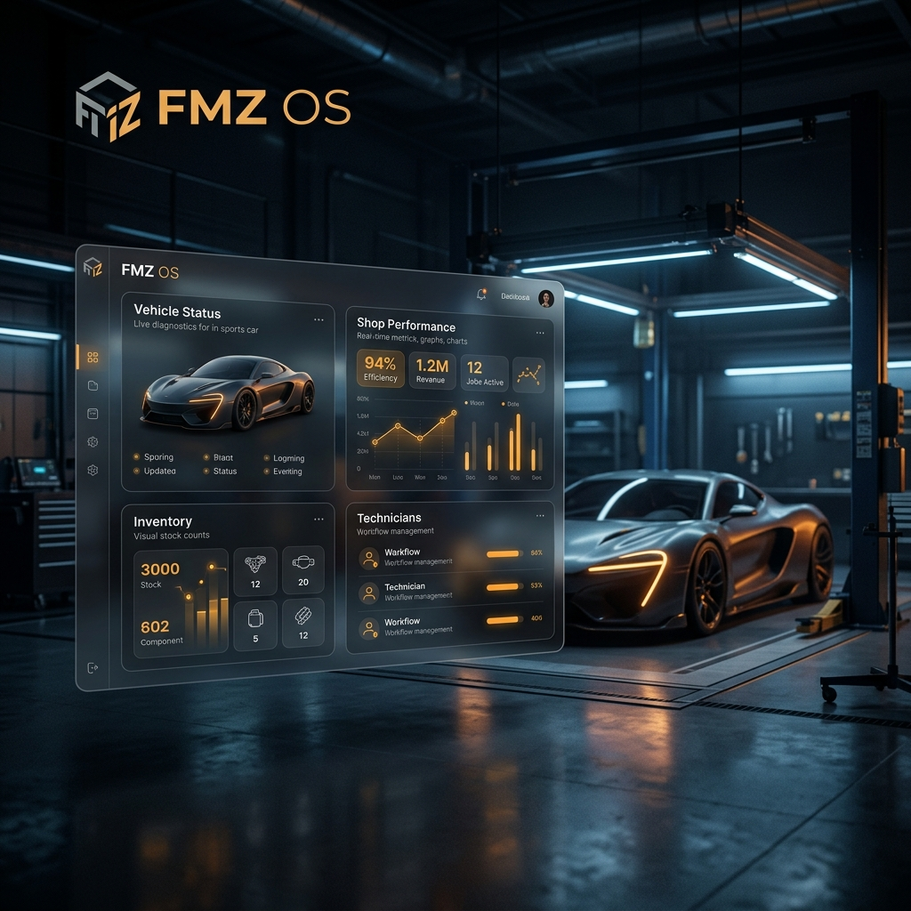

# FMZ Auto Workshop OS | v2.0.26

## 🏎️ Engineering Excellence in Motion
**FMZ Auto Workshop OS** is a studio-grade, next-generation platform designed to streamline automotive service operations. Built with a focus on high-fidelity user experiences and industrial reliability, it bridges the gap between customer transparency and workshop mastery.

> "Precision in every turn. Mastery in every pixel."

---

## 💎 Operational Layers

### 1. The Command Center (Landing)
A cinematic entry point that establishes immediate trust. Featuring Apple-standard motion design, glassmorphic UI elements, and a high-performance typography system.

### 2. Seamless Intake (Booking)
A refined, three-step onboarding engine designed to eliminate friction.
- **Intelligent Scheduling**: Filters closed days and optimizes shop load.
- **Studio Aesthetics**: High-blur containers and atmospheric gradients.

### 3. Real-Time Mastery (Tracking)
A live transparency portal for the customer.
- **Hold-to-Speak AI**: Voice-based vehicle identification (2026 Standard).
- **Live Timeline**: Real-time status updates with automated re-polling.
- **Interactive Map**: Visual vehicle localization within the workshop ecosystem.

### 4. Workshop Control (Admin)
The heavy-duty management core.
- **Kanban Power-Board**: 6-column industrial workflow management.
- **Neural Analytics**: Real-time workload and diagnostics tracking via Recharts.
- **QR Engine**: Automated vehicle identification and check-in systems.

---

## 🛠️ Tech Stack
This platform is built on a rock-solid, production-ready **Vite SPA** architecture:

- **Frontend**: React 19 + TypeScript
- **Routing**: TanStack Router (Type-Safe Navigation)
- **Styling**: Tailwind CSS v4 (Official Plugin)
- **Icons**: Lucide React (Studio Grade)
- **Animations**: Framer Motion / CSS Keyframes
- **State**: TanStack Query + Custom Event Engine

---

## 🏗️ Architecture & Deployment
The app has been optimized for **Vercel** with a clean, standard Vite build process.
- **Build Engine**: `npm run build` (Standard Vite)
- **Output**: `dist/` (Native Vercel Serving)
- **Compatibility**: 100% SPA Reliability

---

## ✍️ Authorship & Prototype Notice
**Designed & Engineered by Suhail Wohedally**

This project is a **Visual Prototype** intended to showcase the future of workshop management. Every interaction, animation, and layout has been meticulously crafted to meet 2026 digital standards.

---

© 2026 FMZ Auto Workshop OS. All rights reserved.
